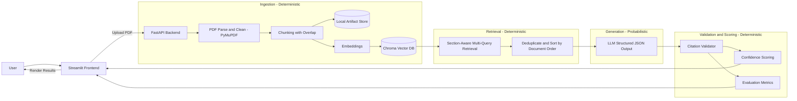

# PolicyExplainer Architecture

This document describes the end-to-end architecture of PolicyExplainer, a modular Retrieval-Augmented Generation (RAG) system for insurance policy intelligence with strict grounding, citation enforcement, and evaluation-backed outputs.

PolicyExplainer is designed to prioritize reliability and transparency over open-ended generation. All outputs are restricted to the uploaded document. Unsupported claims are filtered out through deterministic validation.

---

# System Overview

PolicyExplainer is composed of two layers:

- Frontend (Streamlit): user interface, workflow orchestration, and document interactions
- Backend (FastAPI): ingestion, retrieval, LLM orchestration, citation validation, and evaluation

High-level responsibilities:

- Streamlit handles user actions (upload, summary, FAQs, Q&A, export)
- FastAPI performs all document processing and RAG operations
- Chroma stores embeddings for retrieval
- Local storage persists artifacts for reproducibility and auditing

---

# High-Level Data Flow



---

# Component Breakdown

## Frontend (Streamlit)

Primary responsibilities:

- Policy upload experience
- Navigation: Summary, New Policy, Save Insurance Summary, FAQs
- Policy Assistant chat interface
- Evidence display (citations and page references)
- Exporting summaries to PDF
- Session state management per document

Design principle:
Keep frontend focused on UX and orchestration while centralizing all document logic in the backend.

---

## Backend (FastAPI)

The backend owns the system’s core logic. It is responsible for:

- Ingestion: parse and clean PDF text, chunk deterministically, persist artifacts
- Retrieval: vector search with section-aware queries, deduplicate and order chunks
- Summarization: structured section summaries with citations
- Q&A: grounded answers with citation enforcement and confidence scoring
- FAQs: policy-specific question generation grounded in the document
- Evaluation: scoring outputs on faithfulness, completeness, and simplicity

Core backend modules:

- ingestion.py
- retrieval.py
- summarization.py
- qa.py
- evaluation.py
- storage.py
- schemas.py
- utils.py
- api.py
- main.py

---

# Ingestion Pipeline

The ingestion stage is deterministic and reproducible.

1. PDF Parsing
   - Extract text per page using PyMuPDF
   - Clean headers and formatting artifacts
   - Reject empty or unusable documents

2. Chunking
   - Token-based segmentation (approximately 500–800 tokens)
   - Sliding overlap (~80 tokens)
   - Deterministic chunk IDs:

     ```
     c_{page_number}_{chunk_index}
     ```

3. Persistence
   - Save raw.pdf
   - Save pages.json
   - Save chunks.jsonl
   - Embed chunks and store in Chroma

Artifact layout:

```
data/documents/{doc_id}/
├─ raw.pdf
├─ pages.json
├─ chunks.jsonl
├─ policy_summary.json
└─ evaluation_report.json
```

Vector database:

```
./chroma_data
```

---

# Retrieval Layer

Retrieval uses section-aware multi-query logic instead of a single embedding query.

Example for Cost Summary:

- deductible
- copay
- coinsurance
- out_of_pocket_maximum
- premium

Algorithm:

1. Run vector search for each sub-query
2. Merge results
3. Deduplicate by chunk_id
4. Sort by page_number and chunk_index
5. Limit context window size

Benefits:

- Higher recall
- Reduced risk of missing sparse policy terms
- Stable document-order context for LLM
- Mitigates Lost-in-the-Middle effects

---

# Generation Layer

Generation is the only probabilistic component.

The model must return structured JSON, not free-form text.

Tasks include:

- Section summaries
- FAQs
- Grounded Q&A

All generation tasks:

- Receive bounded retrieved context
- Enforce schema output
- Require citations per bullet or answer unit

---

# Citation Validation

Citation validation is deterministic and mandatory.

Validation rules:

- Only allow chunk_ids from retrieved context
- Drop unsupported bullets automatically
- Normalize page references
- Record validation warnings

If no supporting evidence exists:

```
Not found in this document.
```

No external knowledge is used.

---

# Confidence Scoring

Confidence is derived from deterministic signals:

- Citation density
- Citation validity
- Retrieval strength
- Validation warnings
- Coverage consistency

Confidence reflects reliability relative to the document, not legal accuracy.

---

# Evaluation Framework

Evaluation is deterministic and executed post-generation.

Three independent metrics are computed:

## Faithfulness (0.0 – 1.0)

Measures grounding strength.

Logic:
- Token overlap threshold
- Numeric consistency checks
- Citation validation

Higher score = stronger grounding.

---

## Completeness (0.0 – 1.0)

Measures coverage across weighted policy sections.

Example weights:

- Cost Summary (35%)
- Covered Services (30%)
- Administrative Conditions (15%)
- Exclusions and Limitations (10%)
- Plan Snapshot (5%)
- Claims and Appeals (5%)

Higher score = broader and more balanced coverage.

---

## Simplicity (0.0 – 1.0)

Measures readability improvement relative to the original policy.

Components:

- Readability improvement (Flesch delta, sentence length reduction)
- Jargon reduction (domain term frequency decrease)
- Structural clarity (bullet formatting vs dense paragraphs)

Example composition:

```
Simplicity Score =
0.4 * readability_improvement
+ 0.4 * jargon_reduction
+ 0.2 * structural_clarity
```

Higher score = clearer and more understandable summary.

---

# Deterministic vs Probabilistic Layers

Deterministic:

- Chunking
- Retrieval ordering
- Deduplication
- Citation validation
- Confidence scoring
- Faithfulness scoring
- Completeness scoring
- Simplicity scoring

Probabilistic:

- LLM generation

This separation reduces hallucination risk and increases auditability.

---

# Reproducibility

Reproducibility is achieved through:

- Persisted raw documents
- Stored chunk artifacts
- Deterministic retrieval logic
- Fixed model versions via environment configuration
- Stored evaluation reports per document

Re-running ingestion on the same PDF produces identical chunk structure.

---

# Security and Deployment Considerations

Recommended production hardening:

- Restrict CORS origins
- Add authentication for API endpoints
- Avoid logging sensitive content
- Store secrets only in environment variables
- Implement document retention policies

---

# Summary

PolicyExplainer is an end-to-end RAG system engineered for:

- Deterministic ingestion and retrieval
- Structured generation
- Strict citation enforcement
- Multi-axis evaluation (Faithfulness, Completeness, Simplicity)
- Artifact persistence for auditability

The architecture prioritizes grounded, measurable, and transparent outputs over open-ended generation.

---

End of Architecture Document.
